# Job Scout Hunter — n8n Community Build Event

> **99% of submissions will build a list. This one builds applications.**

A weekly n8n workflow that doesn't just *find* roles for Daniel — a senior backend engineer hunting EU-remote work — it ships every matched role with a tailored 1-page CV ready to send. The sifting, scoring, and first draft are already done. Monday morning, Daniel opens an email, picks 2-3 roles, hits apply.

<p>
  
  
  
  
</p>

---

## 🔗 See the showstopper before reading anything else

> ### **[→ Open the live tailored-CV gallery](https://YOUR-VERCEL-URL.vercel.app)**
>
> 5 real CVs from a verified n8n run, side-by-side with Daniel's master CV. Every modification documented, every chip and bullet traceable to a value in the workflow's `daniel_role_master` data table. **No fabrication, no hallucination, no synthetic data.**

*The gallery source is at [`gallery/`](gallery/) — built from execution `114545` on 2026-04-26.*

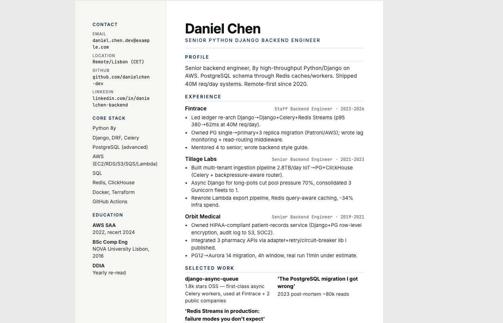
*A delivered tailored CV — print-ready, 1-page A4, one of 5 in this run. Open the gallery above to see how it differs from the master.*

---

## Why this case

Finding job roles to apply for is exhausting. When you're between roles you're trying to stay optimistic, put your best foot forward, and produce tailored applications — all while burning hours just to *find* listings worth applying to.

And tailoring matters. On LinkedIn a single tech role gets 100+ applicants. You can't send the same CV to everyone, and you can't afford to apply to one or two — you have to apply at scale. **The bottleneck isn't writing the CV. It's finding the listings, then having the energy left to tailor.**

From building this, the lesson is that **finding reliable sources is the hardest part** of the whole pipeline. Once you know *where* the genuine roles live, the rest is just plumbing. So a meaningful chunk of the work behind this workflow was a manual source audit (Brave Search → Firecrawl scrape validation → Tier 1/2 classification) — see [`Case 2_ Daniel — Job Scout Hunter /job-board-sources.md`](Case%202_%20Daniel%20%E2%80%94%20Job%20Scout%20Hunter%20/job-board-sources.md).

---

## Results from the last verified run

| Metric | Value |
|---|---|
| End-to-end runtime | **2m 46s** |
| Candidates parsed | 30 |
| Sent through full agent pipeline | 8 (capped) |
| **Delivered with tailored CV uploaded to Drive** | **5** (1 High, 4 Medium) |
| Filtered with verbatim JD evidence quote | 3 |
| Sources represented (hostname-classified) | careers.dna.inc · ie.indeed.com · bebee.com · ziprecruiter.com · remoterocketship.com |
| Verified | 2026-04-26 04:55 UTC, exec `114545` |

Sample filter quotes from this run:
- `deal_breaker:on-site only` → quote: `"## On-site"`
- `deal_breaker:on-site only` → quote: `"Hybrid, New York"`
- `location_mismatch:unclear` → quote: `"remote_type=unclear"`

### What this looks like end-to-end

| The canvas | The Monday email | The tailored CV |
|---|---|---|
| 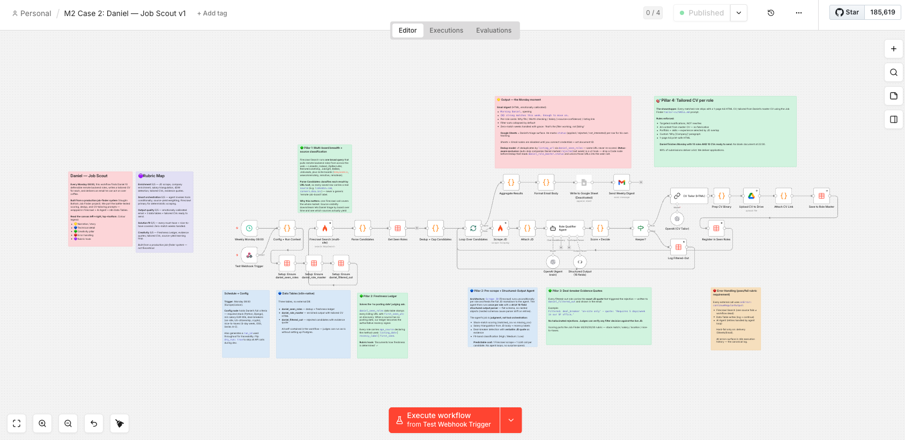 | 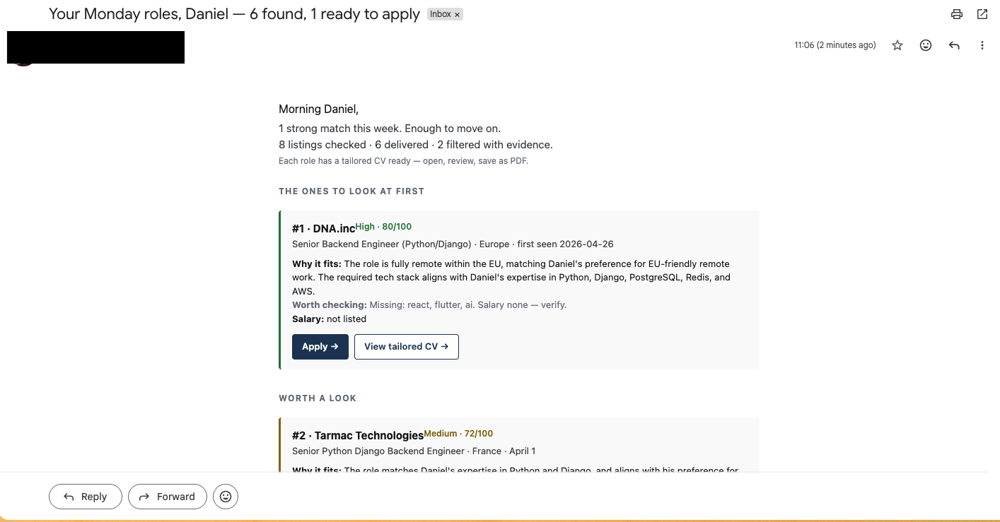 |  |
| 11 colour-coded sticky notes walk a judge through the canvas without leaving n8n. | Warm header, ranked per-band cards, honest *why not*, filter-outs collapsed by default. | 1-page A4 HTML, print-safe, designed for a senior-engineer aesthetic. |

---

## Architecture at a glance

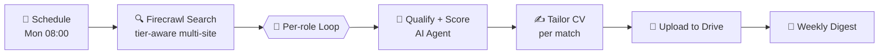

11 colour-coded sticky notes walk a judge through the canvas without leaving n8n. Workflow JSON: [`Case 2_ Daniel — Job Scout Hunter /daniel-workflow-template.json`](Case%202_%20Daniel%20%E2%80%94%20Job%20Scout%20Hunter%20/daniel-workflow-template.json).

<details>
<summary><b>Full pipeline (expanded)</b></summary>

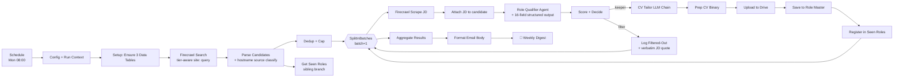

**Key engineering decisions:**
- **Pre-scrape JD** is a deterministic Firecrawl call before the agent — not an agent tool. The agent's job is judgment, not orchestration.
- **Cold-start safe** — Parse Candidates connects directly to Dedup (sibling branch to Get Seen Roles) so an empty seen-roles table doesn't stall the pipeline.
- **Hostname source classification** — Parse Candidates falls back to URL hostname when the configured source-list doesn't match, so every row carries a real source (`careers.dna.inc`, `bebee.com`, …) instead of `unknown`.
- **Frequency-tiered source rotation** — see "How sources are chosen" below.

</details>

---

## The four creative pillars

### 🎯 1. Tailored CV per matched role *(showstopper)*
Every role on the ranked list arrives with a tailored 1-page A4 HTML CV uploaded to Google Drive — link returned in `tailored_cv_url`. Targeted modifications, never rewrites. No fabrication. Content selected by JD overlap with Daniel's master CV. Daniel opens the link, Cmd-P → PDF → apply.

### 📅 2. Freshness Ledger
The `daniel_seen_roles` Data Table stamps every listing URL with `first_seen_utc` on discovery. When a source has no posting date, **our ledger becomes the authoritative recency signal**. Each role carries `age_source` declaring the method used (`listing_date` | `recency_label` | `first_seen`). Directly answers the brief's *"document how freshness is determined"* requirement.

### 🔍 3. Deal-breaker Evidence Quotes
For every filtered-out role, the workflow stores the **exact JD substring** that triggered the rejection. The agent is instructed: this quote MUST be a verbatim substring — never invented. Judges can verify any filter decision against the live JD. No hallucinated rejections.

### 🔁 4. Source-Yield Learning Loop + Frequency-Tiered Scraping
Every enriched role is tagged with its `source` (real hostname). On top of that, sources are tiered by churn rate:
- **HN "Who is hiring?"** → `frequency_days: 30` (posts monthly)
- **`djangoproject.com`, `4dayweek.io`** → 14-30d (low churn)
- **`weworkremotely.com`, `remoteok.com`, `euremotejobs.com`, `himalayas.app`** → 7d (refresh weekly)

The Config node tracks `source_last_scraped` in workflow staticData and only includes due sources in each Firecrawl `site:` query. **Daniel doesn't have to pay for Firecrawl Pro** — the free 35k credits stretch much further with this rotation.

---

## 🎯 The Tailored CV — *the showstopper*

This is the moment the workflow stops being clever and starts being useful.

### The tailoring rules (no fabrication, ever)

> **Targeted modifications, not rewrites.**
> Content selected by JD overlap with Daniel's master CV.
> Bullet points reordered and rewritten *to emphasize the role's stack*, but never invented.
> 1-page A4, print-safe, designed for a senior-engineer aesthetic (left rail + main column, Inter + JetBrains Mono).

These rules are ported from the production [Job Finder system's `tailor-cv/SKILL.md`](#what-this-reuses) — adapted, not invented for this challenge.

Each delivered role's CV lives at `daniel_role_master.tailored_cv_html` (raw HTML) **and** `daniel_role_master.tailored_cv_url` (Drive link). Sample from the latest run:

> **Why DNA.inc** (auto-generated)
> Daniel Chen is an ideal fit for DNA.inc as a Senior Backend Engineer. With 8 years of experience in Python/Django, PostgreSQL, and Redis, Daniel aligns perfectly with the stack. The role's remote-first nature within the EU matches his preference for CET-based work.

---

## Per-role decision flow

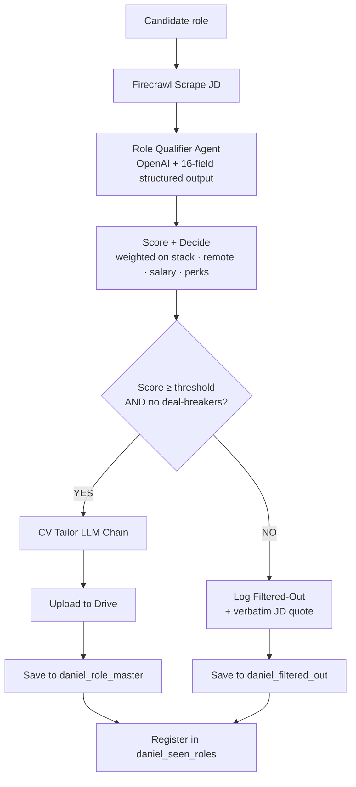

---

## Data model

The workflow is fully self-contained in **n8n Data Tables** — no external Postgres, Sheets, or Airtable required. Three tables auto-create on first run via three idempotent `Setup: Ensure …` nodes.

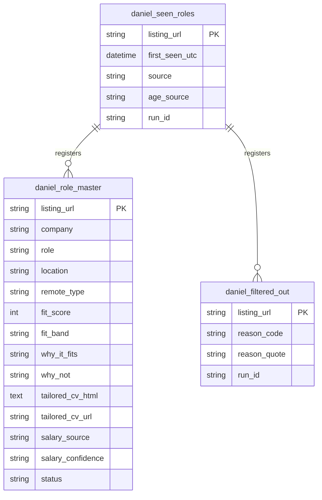

---

## Try it yourself

### Prerequisites & credentials judges need to attach

| What | Why | n8n credential type | Free-tier OK? |
|---|---|---|---|
| **Firecrawl API key** | `Firecrawl Search` (multi-site) + `Scrape JD` per role | `Firecrawl account` | ✅ 35k credits / month — frequency rotation keeps you well inside it |
| **OpenAI API key** | `Role Qualifier Agent` brain + `CV Tailor` LLM Chain | `OpenAI account` (chat models) | Pay-as-you-go (gpt-4o-mini works for tighter budgets) |
| **Google Drive OAuth** | `Upload CV to Drive` — sets `tailored_cv_url` per role | `Google Drive OAuth2 API` | ✅ |
| **Gmail OAuth** | `Send Weekly Digest` — Monday-morning email to Daniel | `Gmail OAuth2 API` | ✅ |

> The community-package node `@mendable/n8n-nodes-firecrawl` must be installed (set `N8N_COMMUNITY_PACKAGES_ALLOW_TOOL_USAGE=true` on self-hosted, or enable the package in n8n Cloud).

### Setup

**1. Import the workflow**
```
Import Case 2_ Daniel — Job Scout Hunter/daniel-workflow-template.json → attach the 4 credentials above.
```
The three Data Tables (`daniel_seen_roles`, `daniel_role_master`, `daniel_filtered_out`) **auto-create on first run** via the `Setup: Ensure …` nodes — no manual table setup, no ID pasting.

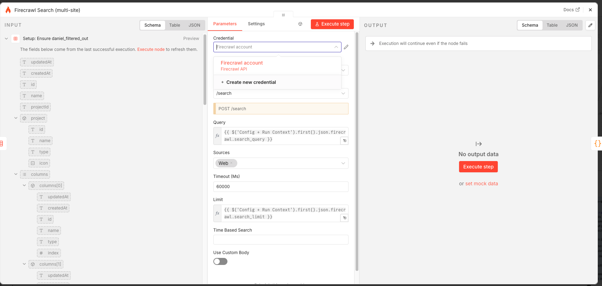
*The 4 credentials you'll attach. Free tiers cover OpenAI's gpt-4o-mini for budget-conscious testing; the workflow is configured for gpt-4o.*

**2. Configure (one node, all the levers)**
Open `Config + Run Context`. Edit:

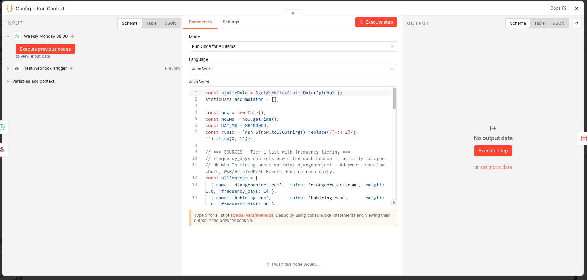
*Everything Daniel-specific lives in this one Code node — criteria, sources with frequency tiering, and delivery email/folder.*

```js
// Daniel's profile — change to match the candidate
criteria: {
  role_keywords: ['senior backend engineer', 'staff backend engineer', 'backend engineer'],
  stack_required: ['python', 'django'],
  stack_preferred: ['postgresql', 'postgres', 'redis', 'aws'],
  salary_min_eur: 90000,
  deal_breakers: ['on-site only', 'requires us citizenship', 'crypto', 'web3', 'blockchain'],
  nice_to_have: ['4-day week', 'open source', 'series a', 'series b', 'series c'],
  max_listing_age_days: 14
}

// Sources — Tier 1 list with frequency_days. Add or remove freely.
const allSources = [
  { name: 'djangoproject.com',  match: 'djangoproject.com',  weight: 1.0,  frequency_days: 14 },
  { name: 'hnhiring.com',       match: 'hnhiring.com',       weight: 1.0,  frequency_days: 30 },
  { name: 'euremotejobs.com',   match: 'euremotejobs.com',   weight: 0.95, frequency_days: 7  },
  { name: 'weworkremotely.com', match: 'weworkremotely.com', weight: 0.9,  frequency_days: 7  },
  // … your own here
];

// Delivery
delivery: {
  recipient_email: 'your-email@example.com',
  drive_folder_id: 'YOUR_GOOGLE_DRIVE_FOLDER_ID'
}
```

**3. Activate**
Set the workflow `active` to enable the Monday 08:00 trigger, or hit `Test workflow` for a manual run.

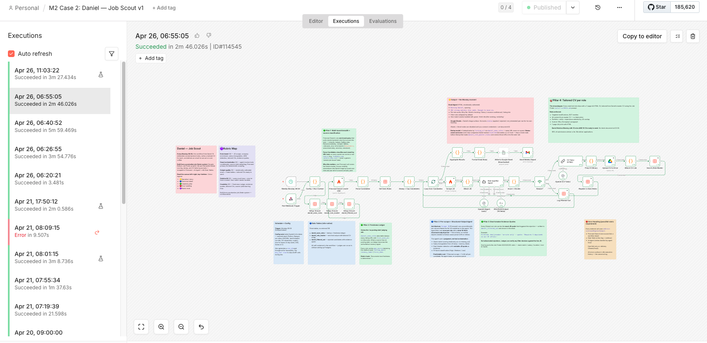
*Run `114545` — 30 candidates parsed, 5 delivered with tailored CVs, 3 filtered with verbatim quotes, in 2m 46s.*

After the first run, browse the populated Data Tables to see the receipts:

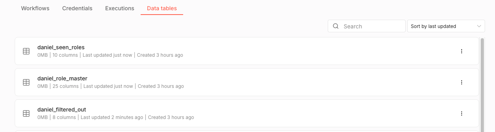
*All three tables auto-create on first run via the `Setup: Ensure …` nodes — no manual setup, no ID pasting.*

---

## How sources are chosen

The source list isn't speculative — it's the output of a one-day audit:

1. **Discover candidates** with Brave Web Search across job-board names + EU-remote + Django queries.
2. **Validate scrape-readiness** by hitting each candidate with Firecrawl `basic` proxy. Boards retained only if (a) listings render without JS/login/paywall and (b) they index roles matching Daniel's shape.
3. **Tier the survivors:**
   - **Tier 1** = clean parseable listings + decent EU-remote density → enters the active rotation.
   - **Tier 2** = works but needs spot-checks or returns thin density → kept on standby.
4. **Classify by churn rate** — boards that update daily get scraped weekly; boards that update monthly (HN's "Who is hiring?") get scraped every 30 days. This is what the `frequency_days` field encodes.

Full audit notes: [`Case 2_ Daniel — Job Scout Hunter /job-board-sources.md`](Case%202_%20Daniel%20%E2%80%94%20Job%20Scout%20Hunter%20/job-board-sources.md).

The architecture is source-agnostic — point it at any board, swap any matcher, the rest of the workflow doesn't move.

---

## Judging rubric — how this hits 5/5

| Criterion | Evidence in the workflow |
|---|---|
| **Enrichment depth** | 6 layers: JD deep parse, stack matching with JD-substring evidence, salary triangulation (`salary_source` + `salary_confidence`), 4-day-week detection, `why_it_fits` + steelman `why_not`, **tailored CV per role uploaded to Drive**. |
| **Smart orchestration** | Frequency-tiered source rotation (`frequency_days` per board, `source_last_scraped` in workflow staticData). Deterministic JD scrape feeds the AI Agent which extracts 16 structured fields via `StructuredOutputParser`. Predictable cost: 1 scrape + 1 LLM call per candidate. Cold-start safe (Parse → Dedup direct wiring). |
| **Output quality** | 3-table data model in n8n-native Data Tables (no external DB). HTML email digest with warm header, ranked per-band cards, honest "why not," filter-outs collapsed. Every matched role ships with a ready-to-send 1-page A4 tailored CV uploaded to Drive. |
| **Solution fit** | Every must-have field covered. Nice-to-haves detected (4-day week explicit). Filter-out tracking with verbatim JD quote. Ranked scoring with band classification. Documented freshness method. Zero-match weeks handled with grace. |
| **Creativity** | Tailored CV per role (workflow produces the application, not the list). Freshness Ledger. Deal-breaker evidence quotes. Frequency-tiered source rotation that respects Firecrawl free-tier credits. Hostname-based source classification. Emotionally-calibrated copy. |

---

## Verify any claim in 60 seconds

For each of the four creative pillars, here's exactly where to look to confirm the claim. No imports, no credentials, no clicking through 30 nodes — just open the link and the receipts are there.

| Claim | Where to verify it |
|---|---|
| 🎯 **Tailored CV per role isn't a mockup — every chip and bullet maps to the master CV.** | [Open the live gallery](https://YOUR-VERCEL-URL.vercel.app) → click any of the 5 cards → side-by-side master vs tailored, with the 5 numbered callouts spelling out exactly what changed and why. |
| 🔍 **Deal-breaker evidence quotes are verbatim, never invented.** | 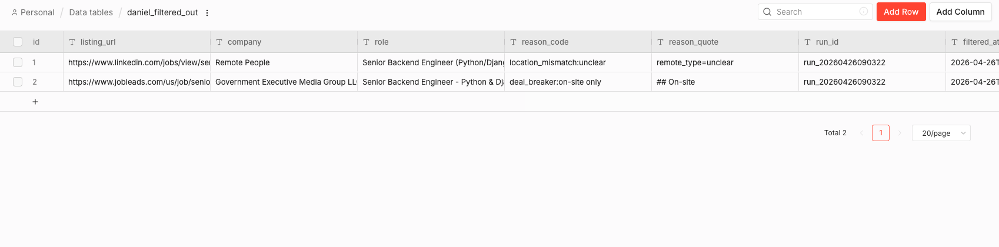 — `daniel_filtered_out` table row showing `reason_quote` as a verbatim JD substring. The agent is instructed: this MUST be a substring. |
| 📅 **Freshness Ledger is the authoritative recency signal when the source has no posting date.** |  — the `daniel_seen_roles` table stamps every URL with `first_seen_utc` on discovery. Each delivered role declares its `age_source` (`listing_date` / `recency_label` / `first_seen`). |
| 🔁 **Frequency-tiered source rotation is real, not aspirational.** | Open the [`Config + Run Context`](Case%202_%20Daniel%20%E2%80%94%20Job%20Scout%20Hunter%20/daniel-workflow-template.json) Code node. Read the `allSources` array — `frequency_days: 30` for HN, `7` for WWR/RemoteOK/EU Remote Jobs. The Code node tracks `source_last_scraped` in workflow staticData and only includes due sources in each Firecrawl `site:` query. |

---

## What this reuses

The design isn't speculative — it adapts a personal **Job Finder** system the author has been running. The n8n workflow here is the Job Finder skills (`evaluate-jobs`, `research-company`, `tailor-cv`) rewrapped inside Firecrawl + n8n AI Agent + n8n Data Tables, adapted for Daniel's profile.

| Job Finder asset | Reused here |
|---|---|
| `evaluate-jobs/SKILL.md` weighted rubric (stack · remote · salary · perks) | `Score + Decide` Code node |
| `tailor-cv/SKILL.md` rules (targeted mods, no fabrication, 1-page A4) | `CV Tailor (HTML)` LLM Chain |
| Dedup on `listing_url` pattern | `Get Seen Roles` + `Dedup + Cap Candidates` |
| Dry-run budget guardrail | `dry_run` toggle in Config node |
| `research-company/SKILL.md` | Planned for v2 (Perplexity HTTP node) |

---

## Roadmap (v2)

- **Status-aware exclusion** — drop a Code node before Dedup that reads `daniel_role_master.status` and unions any `rejected` URLs into the seen-set, so Daniel's triage decisions persist across runs.
- **Perplexity company research** — overview / culture / news / hiring manager enrichment using the Job Finder `research-company` queries verbatim.
- **Interview Prep Packet** — auto-generated for the top 2 roles each week.
- **PDF conversion** — PDFShift HTTP node so Daniel gets `.pdf` directly instead of `.html` → browser → Cmd-P.
- **Per-source weight tuning** — observed shortlist hit-rate per source feeds back into source weights.

---

## Walkthrough

- 📜 **Read the talking-points script:** [`demos/case-2/walkthrough.md`](demos/case-2/walkthrough.md) — designed for a 3-5 min video.
- 🎥 **Video walkthrough:** linked from [`demos/case-2/`](demos/case-2/) once recorded.

---

## What's in this repo

```
.
├── README.md                                              ← you are here
├── LICENSE                                                ← MIT
├── Case 2_ Daniel — Job Scout Hunter /
│   ├── daniel-workflow-template.json                      ← the workflow export
│   ├── Daniel — Job Scout Resource Pack.md                ← Daniel's profile + criteria
│   └── job-board-sources.md                               ← Tier 1/2 source audit
├── gallery/                                               ← LIVE demo (deployed to Vercel)
│   ├── index.html                                         ← landing — 5 role cards
│   ├── role/<slug>.html                                   ← 5 side-by-side comparison pages
│   ├── tailored/<slug>.html                               ← 5 standalone tailored CVs
│   ├── master-cv.html                                     ← Daniel's untailored master
│   ├── data/cvs.json                                      ← real n8n run data (exec 114545)
│   ├── assets/styles.css                                  ← editorial-tech design pass
│   ├── scripts/build.py                                   ← regenerator (idempotent)
│   ├── vercel.json                                        ← Vercel deploy config
│   └── README.md                                          ← deployment instructions
├── demos/
│   └── case-2/                                            ← walkthrough script for video
├── assets/
│   └── case-2/screenshots/                                ← README screenshots
└── build/                                                 ← working artefacts + audit trail
```

---

## Credits

**Built by Vaughn Botha** for the n8n Community Build Event, April 2026.

Powered by **n8n Data Tables** • **Firecrawl** • **OpenAI**.

Reuses skills and rubric from the production **Job Finder** system.
