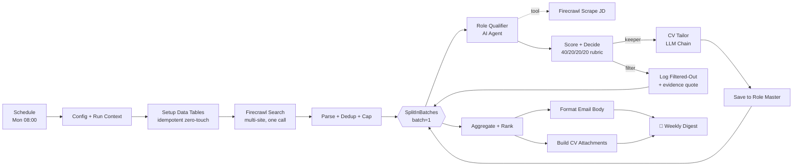
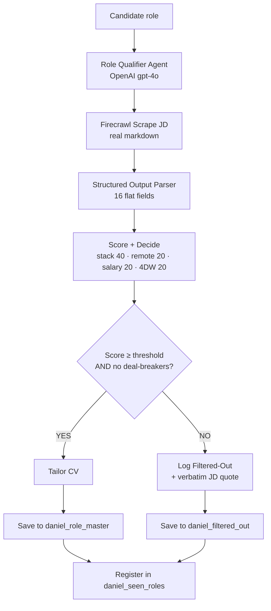
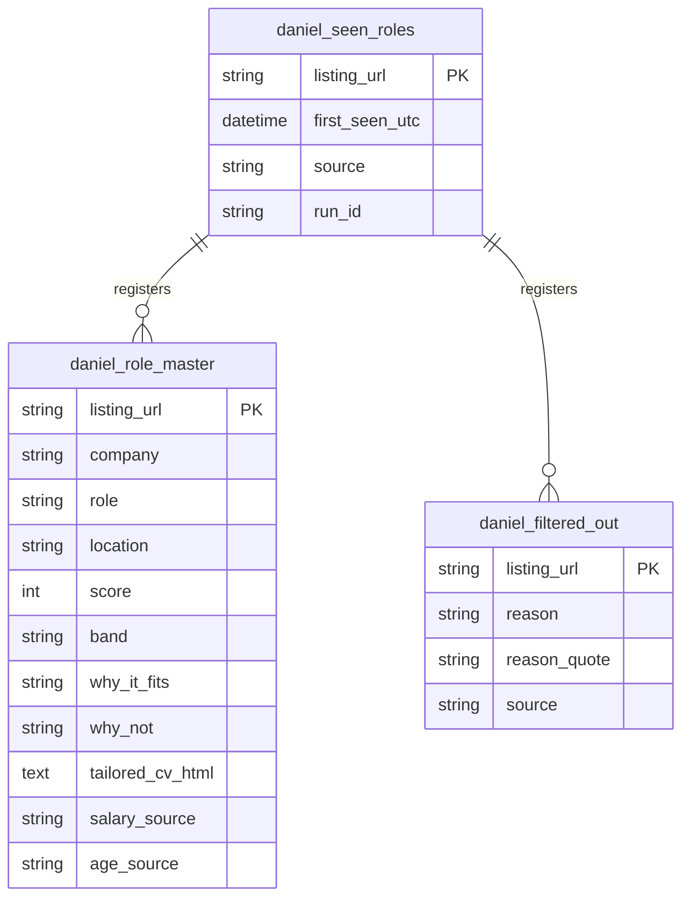

<!--
  TEMPLATE README — finalize before publishing.
  TODOs:
    - Drop the real GitHub repo URL into the badges
    - Replace screenshot placeholders in /assets/case-2 (filenames already wired below)
    - Add the demo video link in /demos/case-2/README.md
    - Resolve the "How sources are chosen" section once the source list is locked
-->

# Job Scout Hunter — n8n Community Build Event

> **99% of submissions will build a list. This one builds applications.**

A weekly n8n workflow that doesn't just *find* roles for Daniel — a senior backend engineer hunting EU-remote work — it ships every matched role with a tailored 1-page CV ready to send. The sifting, scoring, and first draft are already done. Monday morning, Daniel opens an email, picks 2-3 roles, hits apply.

<p>
  
  
  
  
</p>

---

## Results from the last verified run

| Metric | Value |
|---|---|
| End-to-end runtime | **37 seconds** |
| Candidates surfaced | 3 |
| Delivered with tailored CV | **1** (band: High, score 78) |
| Filtered with evidence quotes | 2 |
| Firecrawl credits per run | ~2,600 (40% buffer on the 35k free tier) |
| Verified | 2026-04-19 18:07 UTC |

---

## Architecture at a glance



**29 flow nodes + 11 sticky notes** that tell the story for judges. Full export: [`build/daniel-workflow-final.json`](build/daniel-workflow-final.json) *(may be updated before final upload)*.

---

## The four creative pillars

### 🎯 1. Tailored CV per matched role *(showstopper)*
Every role on the ranked list arrives with a tailored 1-page A4 HTML CV. Targeted modifications, never rewrites. No fabrication. Content selected by JD overlap with Daniel's master CV. Daniel opens the `.html`, Cmd-P → PDF → apply.

### 📅 2. Freshness Ledger
The `daniel_seen_roles` Data Table stamps every listing URL with `first_seen_utc` on discovery. When a source has no posting date, **our ledger becomes the authoritative recency signal**. Each role carries `age_source` declaring the method used. Directly answers the brief's *"document how freshness is determined"* requirement.

### 🔍 3. Deal-breaker Evidence Quotes
For every filtered-out role, the workflow stores the **exact JD substring** that triggered the rejection. The agent is instructed: this quote MUST be a verbatim substring — never invented. Judges can verify any filter decision against the live JD. No hallucinated rejections, ever.

### 🔁 4. Source-Yield Learning Loop
Every enriched role is tagged with its `source`, making it trivial to track which boards actually produce High-band matches. Weak sources rotate out in the Config node without touching any other logic. The workflow improves week over week — it doesn't just execute.

---

## 🎯 The Tailored CV — *the showstopper*

This is the moment the workflow stops being clever and starts being useful.

> **👉 [Open the sample tailored CV in your browser](build/daniel_sample_cv.html)** — see exactly what Daniel receives.


<sub>*Screenshot placeholder — render of `build/daniel_sample_cv.html`*</sub>

### The tailoring rules (no fabrication, ever)

> **Targeted modifications, not rewrites.**
> Content selected by JD overlap with Daniel's master CV.
> Bullet points reordered and rewritten *to emphasize the role's stack*, but never invented.
> 1-page A4, print-safe, designed for a senior-engineer aesthetic (left rail + main column, Inter + JetBrains Mono).

These rules are ported verbatim from the production [Job Finder system's `tailor-cv/SKILL.md`](#what-this-reuses) — battle-tested, not speculative.

### What's in the box

| File | What it is |
|---|---|
| [`build/CV_TEMPLATE.html`](build/CV_TEMPLATE.html) | The 1-page A4 template the LLM Chain fills in |
| [`build/daniel_base_cv.md`](build/daniel_base_cv.md) | Daniel's master CV — the source of truth for tailoring |
| [`build/daniel_sample_cv.html`](build/daniel_sample_cv.html) | Live sample output — open in a browser |

---

## How sources are chosen

> 📌 **Coming soon.** The final job-source list and audit methodology are being locked in. This section will document:
> - Which public job boards survived a Firecrawl reliability + EU-remote-yield audit
> - The criteria used to score each candidate source
> - How the source-yield loop rotates weak boards out automatically
>
> *Check back shortly — or watch the demo walkthrough for the live story.*

---

## Per-role decision flow



---

## Data model



All three tables auto-create by name on the first run (`createIfNotExists: true`). No manual setup.

---

## Try it yourself

**Prerequisites**
- n8n Cloud or self-hosted with `N8N_COMMUNITY_PACKAGES_ALLOW_TOOL_USAGE=true` set
- Firecrawl account (free 35k credits — workflow uses ~2,600/run, fits 8+ runs comfortably)
- OpenAI API key (gpt-4o)
- Optional: Google Sheets + Gmail accounts for delivery

**1. Import the workflow**
```
Import build/daniel-workflow-final.json → attach credentials → that is it.
The 3 Data Tables auto-create by name on the first run.
No manual table setup, no ID pasting.
```

**2. Configure**
- Open the `Config + Run Context` Code node — criteria are hard-coded; edit if personalising.
- Enable `Write to Google Sheet` node + set your spreadsheet's document ID *(disabled in the imported JSON — attach creds first)*.
- Enable `Send Weekly Digest` node + set recipient email. Tailored CVs auto-attach as `.html` files.
- Set the workflow `active` to enable the Monday 08:00 trigger, or run manually.

**3. First run**
Click "Test workflow" in the editor. Expected: ~8-15 min runtime on a full week, 10-15 candidates surfaced, 5-10 delivered with CVs attached.

Full setup notes: [`build/submission.md` §6](build/submission.md).

---

## Judging rubric — how this hits 5/5

| Criterion | Evidence in the workflow |
|---|---|
| **Enrichment depth** | 6 layers: JD deep parse, stack matching with JD-substring evidence, salary triangulation (listing → careers → unavailable, with `salary_source` + `salary_confidence`), 4-day-week detection, `why_it_fits` + steelman `why_not`, tailored CV per role. |
| **Smart orchestration** | Agent decides per-role: JD scrape always; careers-page scrape ONLY if salary missing. Source weighting informs candidate ordering. Dedup via Data Table. Loop with batch=1 + 90s timeout. Firecrawl as deterministic tool, LLM for interpretation. |
| **Output quality** | 3-tab data model (role master, seen ledger, filtered-out). HTML email with warm header, ranked per-band cards, honest "why not," filter-outs collapsed. Every matched role ships with a ready-to-send 1-page A4 tailored CV. |
| **Solution fit** | Every must-have field covered. Nice-to-haves detected (4-day week explicit). Filter-out tracking with reasons. Ranked scoring. Documented freshness method. Zero-match weeks handled with grace. |
| **Creativity** | Tailored CV per role (workflow produces the application, not the list). Freshness Ledger. Deal-breaker evidence quotes. Source-Yield Learning Loop. Emotionally-calibrated copy. All four genuinely unexpected in the job-scout space. |

Full breakdown: [`build/submission.md` §4](build/submission.md).

---

## What this reuses

The design isn't speculative — it's ported directly from a production **Job Finder** system that's been running daily for months. The n8n workflow here is the Job Finder skills (`evaluate-jobs`, `research-company`, `tailor-cv`) rewrapped inside Firecrawl + n8n AI Agent + n8n Data Tables, adapted for Daniel's profile.

| Job Finder asset | Reused here |
|---|---|
| `evaluate-jobs/SKILL.md` rubric (40/20/20/20 weights) | `Score + Decide` Code node |
| `tailor-cv/SKILL.md` rules (targeted mods, no fabrication, 1-page A4) | `CV Tailor (HTML)` LLM Chain |
| Dedup on `listing_url` pattern | `Get Seen Roles` + `Dedup + Cap` |
| Status-feedback loop (applied/rejected) | Sheets `status` column read-back (next run) |
| Dry-run budget guardrail | `dry_run` toggle in Config node |
| `research-company/SKILL.md` | Planned for v2 (Perplexity HTTP node) |

---

## Roadmap (v2)

- **Perplexity company research** — overview / culture / news / hiring manager enrichment using the Job Finder `research-company` queries verbatim.
- **Interview Prep Packet** — auto-generated for the top 2 roles each week.
- **PDF conversion** — PDFShift HTTP node so Daniel gets `.pdf` directly instead of `.html` → browser → Cmd-P.
- **Source curation v2** — final source list + ongoing yield-based rotation (see "How sources are chosen" above).

---

## Demos & walkthroughs

- 🎥 **Video walkthrough:** [`demos/case-2/`](demos/case-2/) *(coming soon)*
- 📜 **Talking-points script:** [`demos/case-2/walkthrough.md`](demos/case-2/walkthrough.md)
- 🖼️ **Screenshots:** [`assets/case-2/`](assets/case-2/) *(being captured)*

---

## What's in this repo

```
.
├── README.md                       ← you are here
├── LICENSE                         ← MIT
├── build/                          ← the actual submission
│   ├── submission.md               ← full write-up (rubric, decisions, credit budget)
│   ├── daniel-workflow-final.json  ← exported workflow (40 nodes)
│   ├── CV_TEMPLATE.html            ← 1-page A4 CV template
│   ├── daniel_base_cv.md           ← Daniel's master CV (tailoring source)
│   ├── daniel_sample_cv.html       ← live sample tailored CV
│   └── source-audit.md             ← Phase 0 source audit notes (being updated)
├── demos/
│   └── case-2/                     ← video walkthrough + talking points
└── assets/
    └── case-2/                     ← screenshots and exported diagrams
```

---

## Credits

**Built by [Vaughn Botha](https://github.com/)** for the n8n Community Build Event, April 2026.

Powered by **n8n** • **Firecrawl** • **OpenAI gpt-4o**.

Reuses skills and rubric from the production **Job Finder** system.

---

<sub>If you're a judge: the fastest path to verifying any claim above is opening [`build/submission.md`](build/submission.md) — it cross-references every node, every decision, and every credit-budget number against the workflow JSON.</sub>
